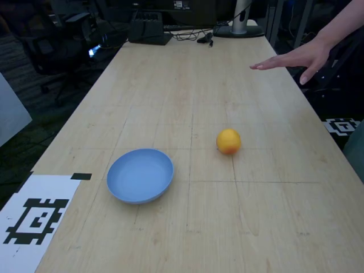
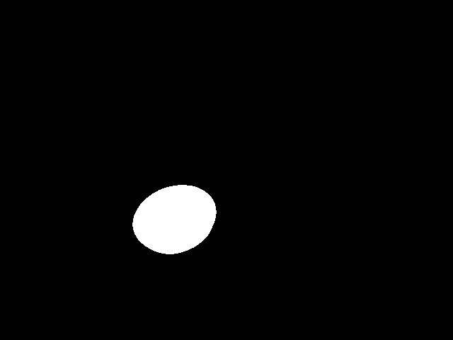
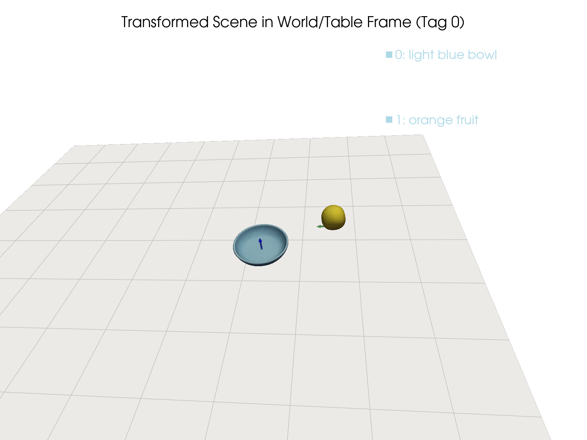
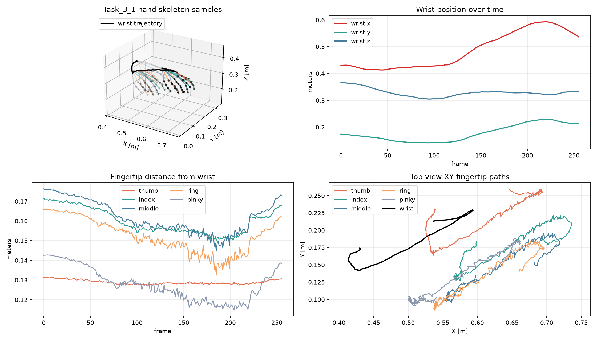

# Video2Sim Forge

Video2Sim Forge is an early-stage robotics pipeline for turning RGB-D scene
captures into simulation-ready assets: object prompts, segmentation masks,
3D meshes, world-frame poses, URDF files, and approximate physics metadata.

The repository is intentionally scoped to the video-to-simulation asset path.
It does not try to cover downstream robot policy training, deployment, or
closed-loop sim2real experiments. Those workflows can consume the exported
scene assets, but they are outside this project boundary.

The current prototype combines:

- Gemini scene analysis for object prompts, task context, and material labels
- SAM3 text-guided segmentation
- SAM3D object reconstruction
- AprilTag/RealSense camera-frame utilities
- mesh pose transforms, visualization, and OBJ-to-URDF export

The goal is to make video-to-simulation workflows more reproducible for robotics
manipulation, warehouse automation, and sim2real experimentation.

## Demo Gallery

The repository includes a small sanitized proof run so reviewers can inspect the
shape of the pipeline without private captures or model checkpoints.

**Input capture preview**

[](examples/proof_run/outputs/input_capture_preview.mp4)

Click the image above to open the short proof-run video:
[examples/proof_run/outputs/input_capture_preview.mp4](examples/proof_run/outputs/input_capture_preview.mp4).

**Pipeline artifacts**

| Capture frame | SAM mask | Final scene visualization |
| --- | --- | --- |
|  |  |  |

**World-frame hand trajectory check**



The hand-trajectory visualization is a bridge artifact for checking whether
recorded hand motion is in the expected robot/table coordinate frame before
using it in downstream retargeting or simulation work.

## Status

This repository is public-alpha quality. The core scripts, docs, tests, and CI
scaffolding are available, but the project still needs sample data, broader
environment validation, and cleaner package boundaries before a stable release.
See [CHANGELOG.md](CHANGELOG.md) for the current alpha release notes.

## Pipeline

1. Gemini scene analysis extracts object prompts, manipulated object labels,
   task type, and material hints from video frames.
2. SAM3 segments each prompted object from the selected RGB frame.
3. SAM3D reconstructs object meshes and estimates 6-DOF poses from RGB-D input.
4. The pipeline assembles a scene JSON in the camera frame.
5. Optional AprilTag transforms export poses and meshes into a table/world frame.
6. Optional visualization saves a rendered scene preview.
7. Optional URDF export estimates mass, inertia, and friction from mesh geometry
   and material labels.

## Quick Start

Install base Python dependencies:

```bash
python -m venv .venv
source .venv/bin/activate
python -m pip install -U pip
python -m pip install -r requirements.txt
```

Copy the example config and point it at your own capture:

```bash
cp config.example.yaml config.local.yaml
```

Set your Gemini key for Step 1:

```bash
export GEMINI_API_KEY="..."
```

Run the orchestrator:

```bash
python scripts/validate_config.py --config config.local.yaml
python run_pipeline.py --config config.local.yaml
```

For SAM3, SAM3D, and RealSense setup, see [docs/dependencies.md](docs/dependencies.md).
For expected capture and output formats, see [docs/input-output.md](docs/input-output.md).
For platform expectations, see [docs/environment.md](docs/environment.md) and
[docs/ubuntu-gpu-setup.md](docs/ubuntu-gpu-setup.md).
For V2S2R hand trajectory and retargeting visualization, see
[docs/hand-trajectory-v2s2r.md](docs/hand-trajectory-v2s2r.md).
For a small completed-run fixture, see [examples/proof_run](examples/proof_run).

## Expected Input

At minimum, a capture should provide:

- `color_video.mp4` or `video.mp4`
- `depth/0.png`, `depth.mp4`, or `depth_video.mp4`
- `cam_K.txt` or `cam_params.txt`
- `scene_capture/image/0.png`
- `scene_capture/depth/0.png`
- optional `camera_frame_pose.json` for world-frame export

See [examples/sample_capture](examples/sample_capture) for the intended layout.

## Main Outputs

```text
output_dir/
├── gemini_scene.json
├── mask_*.png
├── mask_to_prompt_mapping.json
├── obj_*.obj
├── sam3d_results.json
├── scene_output.json
├── scene_output_new.json
├── scene_output_final.json
├── transformed_meshes/
├── urdfs/
├── final_scene_visualization.png
├── pipeline_timing.txt
└── pipeline_timing.json
```

The repository includes a sanitized proof run at
[examples/proof_run](examples/proof_run) with derived JSON outputs and a rendered
scene preview from a completed bowl-and-fruit capture. The proof run includes a
short capture video, first/middle/last input frames, and the final transformed
scene visualization.

The Ubuntu GPU proof run lives at [examples/ubuntu_demo](examples/ubuntu_demo).
It includes sanitized validator output, environment details, run log, masks,
scene JSON files, URDFs, timing, and the final visualization screenshot. To run
the same shape on a local approved capture:

```bash
python scripts/validate_config.py --config examples/ubuntu_demo/config.yaml
python run_pipeline.py --config examples/ubuntu_demo/config.yaml
```

## Development Checks

```bash
python scripts/validate_config.py --config config.example.yaml
python -m compileall -q .
python -m ruff check .
python -m pytest
```

End-to-end execution requires external model environments, API access, and
capture data. Pull requests should state which partial or full checks were run.

## Maintainer Workflow

Video2Sim Forge is maintained with a practical review workflow because many
useful contributions are reviewable without private robot data or GPU-heavy
model runs:

- checking schema compatibility for `scene_output*.json`
- reviewing transform math and failure handling
- generating focused tests for pure Python helpers
- improving setup docs for new CUDA, SAM3, SAM3D, and RealSense environments
- triaging reproducible installation and capture-layout issues

See [docs/maintainer-workflow.md](docs/maintainer-workflow.md) for review,
release, and contribution guidance.

## Roadmap

- Add a small redistributable raw capture that can rerun model-dependent steps.
- Expand the sanitized proof fixture with approved meshes and URDFs.
- Add unit tests for JSON assembly, transform math, and URDF physics export.
- Package shared code into importable modules instead of script-only steps.
- Add Docker or conda-lock setup for reproducible Linux GPU environments.
- Add a documented hand-trajectory retargeting bridge to V2S2R outputs.
- Add benchmark notes for common robotics manipulation scenes.

## Security and Data

Do not commit API keys, private RGB-D captures, generated customer-site assets,
camera serial numbers, or model checkpoints. See [SECURITY.md](SECURITY.md).

## License

MIT License. See [LICENSE](LICENSE).
